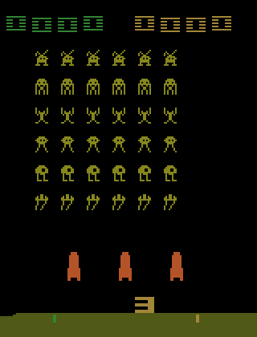

# Deep-Q-Learning

## Results of first training

To train the agent I created a [kaggle](https://www.kaggle.com/) notebook and
used their GPU resources.
The agent was trained on 100k frames with a memory storing up to 50k frames.
For the first 20k frames the program only collected frames to create a starting
training set for the agent. After this, the agent was trained for the next 80k
frames with a random sampled minibatch (32 frames) chosen after every fourth
action performed.

The trained agent was evaluated and the results of one game are shown in the gif
below.

  

**Takeaways**\
We can notice that the agent has learned to move to the right end of the screen
while constantly shooting. The agent has probably learned that it will survive
for the longest if it escapes to the right end of the screen, because the space
invaders spawn at the left end. It also appears to have learned that staying
in the right corner and shooting, while the invaders are moving right is the
most effective way to earn points at the begining of the game.

To have a better trained model, we would need to continue training our agent. A
problem arises when using kaggle notebooks, since the usage is limited to 9
hours per session (this training session was done in 7 hours). Because of this,
for every successive training epoch, the replay memory will only contain frames
from the current epoch. This can be a problem since we want our agent to learn
from a long lasting memory (in the Deepmind papers 
[V. Mnih et al (2013)](https://arxiv.org/pdf/1312.5602.pdf) and
[V. Mnih et al (2015)](https://www.nature.com/articles/nature14236/)
the memory saved up to 1 million frames).