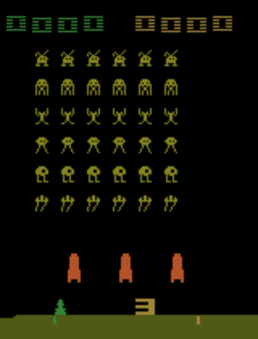

# Deep-Q-Learning

## Training Results Preview

The agent was trained on a local setup with a RTX-4070 Ti Super. It was
trained with a single gymnasium environment for 50M frames (~12.5 hours) and
in it's last 1M frames completed ~500 episode with an average reward of ~1970 points.

<p align="center">
  
</p>

## Setup

Requirements:
- Python 3.12 or higher
- uv

To install the dependencies run one of the following commands

```
uv sync --extra cpu     # CPU-only machine (~200MB)
uv sync --extra cuda    # machine with an NVIDIA GPU (resolves torch+cu126)
```

**Note:** Always pass `--extra cpu` or `--extra cuda`. Otherwise torch/torchvision wont be installed or it will be uninstalled.

In order to simulate Space Invaers, `ale-py` needs the Space Invaders ROM, which isn't bundled — fetch it once per machine with:

```
uv run AutoROM --accept-license -y
```

This downloads to `.venv/lib/python3.12/site-packages/ale_py/roms/` and only needs to be re-run if `.venv` is recreated.

## Start Training

`scripts/train.py` is the entry point for starting a training run:

```
uv run python scripts/train.py
```

The defaults already match the [DeepMinds (2015)](https://www.nature.com/articles/nature14236/) paper's hyperparameters. Run
```
uv run python scripts/train.py --help
```
to see this same list from the CLI.

| Flag | Default | Description |
| --- | --- | --- |
| `--learning-rate` | `0.00025` | Learning rate for the main model's optimizer. |
| `--optimizer` | `rmsprop` | `adam` or `rmsprop`. `rmsprop` uses the paper's *centered* RMSProp (`alpha=0.95`, `eps=0.01`, `centered=True`). Must match the checkpoint's optimizer when using `--resume-from` — Adam's and RMSProp's saved optimizer state aren't interchangeable. |
| `--memory-size` | `1000000` | Number of frames the replay memory ring buffer holds. Must match the checkpoint's size when using `--resume-from` — validated against the saved buffer's shape and the load fails otherwise. |
| `--memory-warmup` | `50000` | Number of frames to collect before training/logging starts. |
| `--batch-size` | `32` | Number of transitions sampled from replay memory per update step. |
| `--max-train-frames` | `60000` | Total number of frames to train for. When resuming, this is the number of *additional* frames for this session, not the new total — a run resumed at frame 2,000,000 with `--max-train-frames 2000000` trains up to frame 4,000,000, not back to 2,000,000. |
| `--update-main-freq` | `4` | Train the main model every N frames. |
| `--update-target-freq` | `10000` | Sync the target model's weights from the main model every N frames. |
| `--log-freq` | `10000` | Print a training progress line every N frames. |
| `--average-loss-freq` | `400` | Average and record the loss over the last N frames. |
| `--discount` | `0.99` | Discount factor (gamma) used in the Q-learning target. |
| `--num-envs` | `1` | Number of parallel ALE sub-envs to train against. `1` uses a `SyncVectorEnv` (single-env behavior); `>1` uses a subprocess-based `AsyncVectorEnv`. `--memory-size` is split evenly across sub-envs, not multiplied by N. |
| `--resume-from` | `None` | Path to a checkpoint directory to resume training from. |
| `--save-path` | `scripts/output` | Path to save the checkpoint to. Ends up holding three independent pieces of state, written every `--checkpoint-freq` frames: replay memory (`replay_memory/`), model + optimizer weights (`model/`), and training history (`history/`). |
| `--metrics-dir` | `scripts/output/metrics` | Directory to write `episodes.csv`/`losses.csv` to incrementally during training. |
| `--checkpoint-freq` | `25000` | Save a checkpoint to `--save-path` every N frames during training. |
| `--replay-checkpoint-freq` | `None` (defaults to `--checkpoint-freq`) | Save the replay memory buffer (the expensive part of a checkpoint) every N frames, independently of `--checkpoint-freq`. Must be a multiple of `--checkpoint-freq`. Set higher than `--checkpoint-freq` to checkpoint model/history often while writing the multi-GB replay buffer less often. |

## Tests

Tests live in `tests/` and run with `pytest`:

```
uv run pytest                    # run everything
uv run pytest tests/unit         # unit tests only (fast, no ALE env)
uv run pytest tests/integration  # integration tests only (real ALE env, small training run)
```

## References
- [Playing Atari with Deep Reinforcment Learning, V. Mnih et al (2013)](https://arxiv.org/pdf/1312.5602.pdf)
- [Human-level control through deep reinforcement learning, V. Mnih et al (2015)](https://www.nature.com/articles/nature14236/)

## License
[MIT](./LICENSE)
