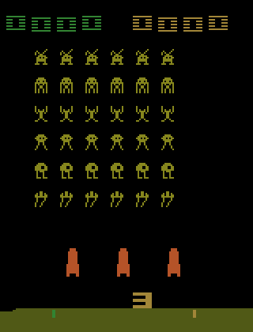

# Deep-Q-Learning

## Setup

The `.venv` (Python 3.12) and `pyproject.toml`/`uv.lock` are managed with [uv](https://docs.astral.sh/uv/) instead of `pip`/`requirements.txt`.

### Everyday commands

- `uv sync --extra <cpu|cuda>` — install/update `.venv` to match `pyproject.toml` + `uv.lock` for the given machine (see "CPU vs GPU torch" below — torch is an optional extra, not a base dependency, so **always pass `--extra`**). Run this after pulling changes that touch dependencies.
- `uv add <package>` — add a new dependency (edits `pyproject.toml`, re-resolves `uv.lock`, installs it). Don't run two `uv add`/`uv sync` at once in the same repo — they race on `pyproject.toml`/`uv.lock`.
- `uv run <command>` — run a command inside `.venv` without manually activating it, e.g. `uv run pytest`. Unlike `uv sync`, its implicit sync defaults to `--inexact` (won't uninstall an already-installed extra just because `--extra` was omitted) — but it also won't *install* torch for you the first time, so still sync explicitly at least once per machine.

### Training

`scripts/train.py` is the entry point for starting a training run:

```
uv run python scripts/train.py
```

Run `uv run python scripts/train.py --help` for the full list of flags (learning rate, memory size,
checkpointing, resuming from a saved run, etc.). The defaults already match the DeepMind 2015 (Nature) paper's
hyperparameters (learning rate 2.5e-4, discount 0.99, minibatch 32, 1M-frame replay memory, 50k-frame warmup,
target network synced every 10k frames).

#### Optimizer

`--optimizer` selects `adam` (default) or `rmsprop`. `rmsprop` uses the paper's *centered* RMSProp (`alpha=0.95`,
`eps=0.01`, `centered=True`). Example, training with RMSProp for 2M frames:

```
uv run python scripts/train.py \
  --optimizer rmsprop \
  --max-train-frames 2000000 \
  --save-path scripts/output-rmsprop \
  --metrics-dir scripts/output-rmsprop/metrics
```

#### Checkpointing and resuming

`--save-path` is a directory that ends up holding three independent pieces of state: the replay memory
(`replay_memory/`), model + optimizer weights (`model/`), and training history (`history/`), written every
`--checkpoint-freq` frames (or `--replay-checkpoint-freq` for the replay memory specifically, if you want to
checkpoint it less often than the rest since it's the expensive part).

To continue a run from a saved checkpoint, pass `--resume-from <path>` pointing at that `--save-path`:

```
uv run python scripts/train.py \
  --optimizer rmsprop \
  --resume-from scripts/output-rmsprop \
  --save-path scripts/output-rmsprop \
  --metrics-dir scripts/output-rmsprop/metrics \
  --max-train-frames 2000000
```

A few things to know about resuming:

- `--optimizer` must match the checkpoint's optimizer — Adam's and RMSProp's saved optimizer state aren't
  interchangeable.
- `--memory-size` must match the checkpoint's replay memory size — it's validated against the saved buffer's
  shape and the load fails otherwise. Leave it unset (default) unless you also set it explicitly on the original
  run.
- `--max-train-frames` is the number of *additional* frames to train this session, not the new total — a run
  resumed at frame 2,000,000 with `--max-train-frames 2000000` trains up to frame 4,000,000, not back to
  2,000,000.
- The other hyperparameters (learning rate, discount, batch size, etc.) aren't re-validated on resume, but keep
  them the same as the original run unless you're intentionally changing the training regime mid-run.

### CPU vs GPU torch

`torch`'s default PyPI wheel on Linux bundles the full CUDA runtime (~2.5GB of `nvidia-*` packages) — unnecessary on a CPU-only machine but exactly what's needed on a machine with an NVIDIA GPU. `torch`/`torchvision` are declared as two mutually-exclusive optional extras instead of plain base dependencies, each pointing at a different wheel index:

```toml
[project.optional-dependencies]
cpu = ["torch", "torchvision"]
cuda = ["torch", "torchvision"]

[tool.uv]
conflicts = [[{ extra = "cpu" }, { extra = "cuda" }]]

[tool.uv.sources]
torch = [
    { index = "pytorch-cpu", extra = "cpu" },
    { index = "pytorch-cuda", extra = "cuda" },
]
torchvision = [
    { index = "pytorch-cpu", extra = "cpu" },
    { index = "pytorch-cuda", extra = "cuda" },
]

[[tool.uv.index]]
name = "pytorch-cpu"
url = "https://download.pytorch.org/whl/cpu"
explicit = true

[[tool.uv.index]]
name = "pytorch-cuda"
url = "https://download.pytorch.org/whl/cu126"
explicit = true
```

- **CPU-only machine**: `uv sync --extra cpu` (~200MB).
- **Machine with an NVIDIA GPU**: `uv sync --extra cuda` — resolves `torch==2.13.0+cu126` and pulls in the matching `cuda-toolkit`/`cuda-bindings` runtime deps. After syncing, verify with `uv run python -c "import torch; print(torch.cuda.is_available())"` — should print `True` if the NVIDIA driver is set up correctly. Bump the `cu126` tag in the `pytorch-cuda` index URL (e.g. `cu130`) if a newer CUDA toolkit is ever needed — check available tags at `https://download.pytorch.org/whl/<tag>/torch/`.

**Footgun:** a bare `uv sync` (no `--extra`) treats torch/torchvision as extraneous and **uninstalls them**, since `uv sync` defaults to an exact sync and neither extra is enabled by default. Always pass `--extra cpu` or `--extra cuda`.

### Atari ROMs

`ale-py` needs the Space Invaders ROM, which isn't bundled — fetch it once per machine with:

```
uv run AutoROM --accept-license -y
```

This downloads to `.venv/lib/python3.12/site-packages/ale_py/roms/` and only needs to be re-run if `.venv` is recreated.

### Tests

Tests live in `tests/` and run with `pytest` (a dev-only dependency — `uv add --dev <package>` to add more, they're kept out of the runtime `dependencies` list). `pyproject.toml`'s `[tool.pytest.ini_options]` puts the repo root on the path so `from src....` imports resolve without a `conftest.py`. Unit and integration tests are split into separate directories, and the integration ones also carry an `integration` marker:

- `tests/unit/` (`test_replay_memory.py`) — fast, no gym env or real training involved.
- `tests/integration/` (`test_agent.py`) — spins up the real ALE env and runs actual (small-scale) training/save/load, so slower.

```
uv run pytest                              # run everything
uv run pytest tests/unit           # unit tests only, by directory
uv run pytest -m "not integration"         # unit tests only, by marker
uv run pytest tests/integration    # integration tests only, by directory
uv run pytest -m integration               # integration tests only, by marker
```

## Results of first training

To train the agent I created a [kaggle](https://www.kaggle.com/) notebook and
used their GPU resources.
The agent was trained on 100k frames with a memory storing up to 50k frames.
For the first 20k frames the program only collected frames to create a starting
training set for the agent. After this, the agent was trained for the next 80k
frames with a random sampled minibatch (32 frames) chosen after every fourth
action performed.

The trained agent was evaluated and the results of one game are shown in the gif
below.

<p align="center">
  
</p>

**Takeaways**\
We can notice that the agent has learned to move to the right end of the screen
while constantly shooting. The agent has probably learned that it will survive
for the longest if it escapes to the right end of the screen, because the space
invaders spawn at the left end. It also appears to have learned that staying
in the right corner and shooting, while the invaders are moving right is the
most effective way to earn points at the begining of the game.

To have a better trained model, we would need to continue training our agent. A
problem arises when using kaggle notebooks, since the usage is limited to 9
hours per session (this training session was done in 7 hours). Because of this,
for every successive training epoch, the replay memory will only contain frames
from the current epoch. This can be a problem since we want our agent to learn
from a long lasting memory (in the Deepmind papers 
[V. Mnih et al (2013)](https://arxiv.org/pdf/1312.5602.pdf) and
[V. Mnih et al (2015)](https://www.nature.com/articles/nature14236/)
the memory saved up to 1 million frames).